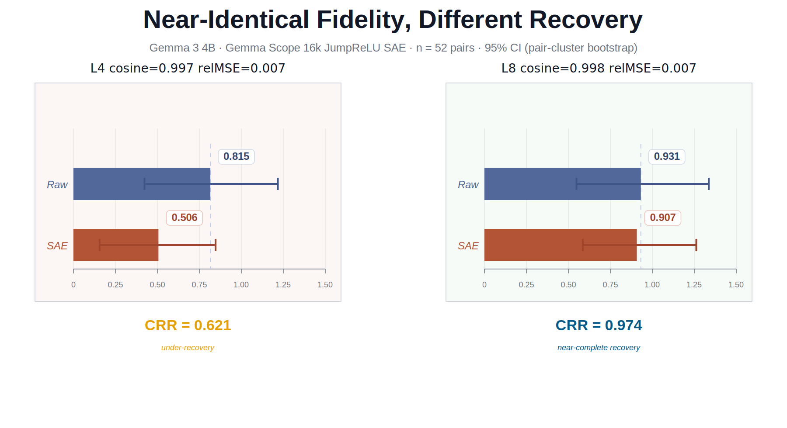

# Geometric Fidelity Does Not Certify Behavioral Preservation

**Paper:** [`paper/sae_writeback_limitation_short_paper.md`](paper/sae_writeback_limitation_short_paper.md)

This repo accompanies a paper that asks a single question: if a sparse
autoencoder reconstructs an activation with high fidelity in vector space, does it
also preserve that activation's causal effect on model behavior?

The main result is a layer-specific L4/L8 contrast. In Gemma 3 4B, layers 4
and 8 both show strong standard reconstruction diagnostics. FVU is lower at L8
than at L4 as a point estimate, but the two layers still show very different
behavioral recovery under matched SAE reconstruction patching:

| Layer | Cosine | RelMSE | FVU | CRR |
|-------|-------:|-------:|----:|----:|
| L4 | 0.997 | 0.007 | 0.137 | **0.621** |
| L8 | 0.998 | 0.007 | 0.060 | **0.974** |

The point is not that SAEs fail in general. The point is that standard
reconstruction diagnostics do not by themselves certify behavior preservation
under matched activation patching at a given layer-token intervention site.

Scope is deliberately narrow: one model (Gemma 3 4B), one task (homograph
disambiguation), 52 paired evaluation cases. The L4/L8 contrast is substantial
even within this controlled setting.



*Figure 1. L4 and L8 both show strong reconstruction diagnostics, with lower point-estimate FVU at L8 than L4, but only L8 shows high recovery of the raw activation-patching effect.*

---

## Reviewer Quick Path

From a fresh checkout, export a Hugging Face token with accepted access to
`google/gemma-3-4b-pt`, then run the single-command GPU quickcheck:

```bash
export HF_TOKEN="hf_..."
make limitation-reviewer-check-gpu
```

This creates the local `.venv`, installs `requirements.txt`, checks that the
paper numbers match the committed limitation artifacts, prepares the model/SAE
assets, and runs the fastest paper-specific claim check.

The single command is equivalent to:

```bash
make limitation-number-check
make limitation-assets
make limitation-one-result-gpu
```

Use `make limitation-one-result` instead of `make limitation-one-result-gpu`
when no accelerator is available. The asset target reads `HF_TOKEN` through
`huggingface_hub`; no separate Hugging Face CLI login is required.

---

## Asset Preparation

Both runnable surfaces below assume model and SAE assets are present locally.
Run this once before the first quickcheck or rerun:

```bash
make limitation-assets
```

This downloads/caches the pinned Gemma 3 4B snapshot and prepares the Gemma
Scope 16k JumpReLU SAE bundle. Subsequent runs reuse cached assets.

Fresh machines need accepted Hugging Face access to `google/gemma-3-4b-pt` and
a valid `HF_TOKEN`. The target disables Hugging Face's optional fast-transfer
path internally, so the optional `hf_transfer` package is not required.

---

## Run the Main Claim

```bash
make limitation-one-result-gpu
```

This is the accelerator-backed **layer-4 limitation quickcheck**. It runs a
fresh L4 comparability check and verifies it against the checked-in public
reference.

**Outputs:**

- `comparability/l4/comparability.summary.json`
- `one_result_check_report.md`
- `one_result_check_log.json`

**How to read the result:**

| Status | Meaning |
|--------|---------|
| `PASS` | Identity fields, counts, and governed headline metrics match within tolerance |
| `WARN` | Expected accelerator-only drift (mainly auxiliary PCA baseline) |
| `FAIL` | Fresh run drifted on a governed field or metric |

CPU fallback (no accelerator required):

```bash
make limitation-one-result
```

**Observed on RunPod RTX 4090** (assets already local):

- Wall time: **6m 13s**
- Working footprint: **~20 GB** (9.7 GB HF cache · 1.6 GB SAE bundle · 8.2 GB venv)

### Environment notes

- Validated on RunPod RTX 4090 (Ada) with the pinned `torch==2.5.1` stack from
  `requirements.txt` (CUDA 11.8, 12.1, and 12.4 wheels available).
- **Not yet validated on Blackwell GPUs (RTX 5090, B200).** The pinned torch
  stack predates Blackwell validation; a newer torch/CUDA stack may be required.
- On a mismatched accelerator stack, expect `torch.cuda.is_available() == False`,
  `Requested device is unavailable`, or CUDA errors such as
  `no kernel image is available`.
- CPU fallback (`make limitation-one-result`) is hardware-agnostic.

This quickcheck validates the public L4 limitation surface only. It does not
rerun L8, top-k, or rebuild the full release surface.

---

## Full Reproduction

For the full limitation rerun and release-surface rebuild:

```bash
make limitation-assets
make limitation-reproduce LIMITATION_REPRODUCE_ARGS="--run_root /tmp/sae_limitation_full --device cpu"
make limitation-reproduce-verify LIMITATION_REPRODUCE_VERIFY_ARGS="--run_root /tmp/sae_limitation_full"
```

This rebuilds the limitation analysis from local assets and writes:

- a limitation reproduction report and JSON log
- fresh source summaries and derived summaries
- release `results/`, `tables/`, and `figures/`
- a verification pass against the committed governance surface

The committed release surface is the CPU float32 reference profile recorded in
`tables/sae_writeback_limitation_release/release_manifest.json`. Accelerator
runs are useful for quickchecks, but the full canonical comparison should be
made against the CPU profile.

Wall time depends on hardware and cache state; expect substantially longer than
the quickcheck.

## Render the Paper PDF

The arXiv-facing PDF is rendered from the canonical short paper markdown:

```bash
make paper-pdf
```

This writes `output/pdf/sae_writeback_limitation_short_paper.pdf` using the
repo-local arXiv-style template in `paper/templates/arxiv_preprint.tex`.

---

## Canonical Artifacts

| Type | Path |
|------|------|
| Paper | `paper/sae_writeback_limitation_short_paper.md` |
| Evaluation data | `data_paper_hardened_v2/disamb_pairs.jsonl` (canonical frozen hardened DISAMB snapshot; 52 paired homograph disambiguation cases) |
| L4 results | `results/sae_writeback_limitation_release/comparability/l4/comparability.summary.json` |
| L8 results | `results/sae_writeback_limitation_release/comparability/l8/comparability.summary.json` |
| Main table | `tables/sae_writeback_limitation_release/centerpiece_summary.csv` |
| Top-k table | `tables/sae_writeback_limitation_release/topk_summary.csv` |
| Quickstart | `docs/SAE_WRITEBACK_LIMITATION_QUICKSTART.md` |
| CPU full-run record | `docs/runs/sae_limitation_cpu_fvu_v2.md` |

## Code Orientation

For reviewers who want to read the implementation:

- [`scripts/clt_raw_comparability.py`](scripts/clt_raw_comparability.py) —
  the primary DISAMB experiment: arm design, patching pipeline, bootstrap
  aggregation, and projection controls (see module docstring for the arm legend)
- [`scripts/limitation_analysis_policy.py`](scripts/limitation_analysis_policy.py) —
  defines the primary DISAMB row-inclusion policy
  (`limitation_analysis_included`); invariant gates stay diagnostic-only
- [`scripts/limitation_surface.py`](scripts/limitation_surface.py) —
  governance layer: derives public tables, figures, and the release manifest
  from committed source artifacts
